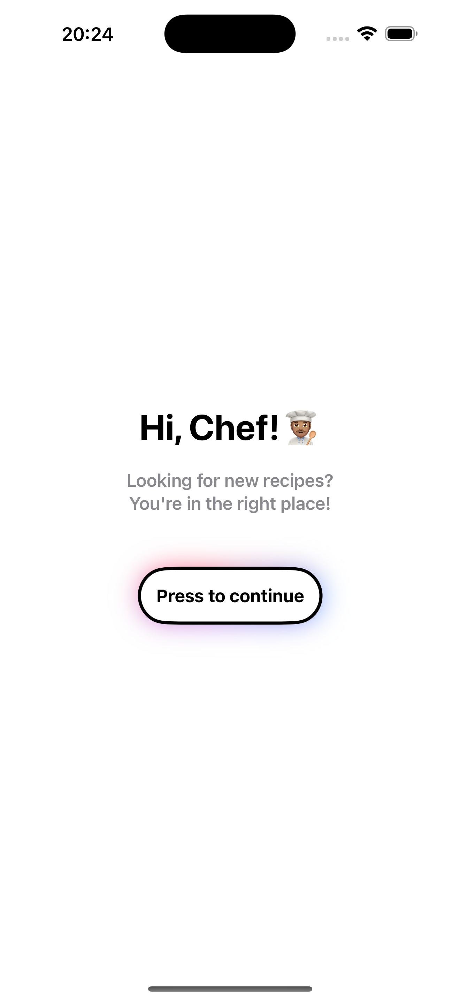
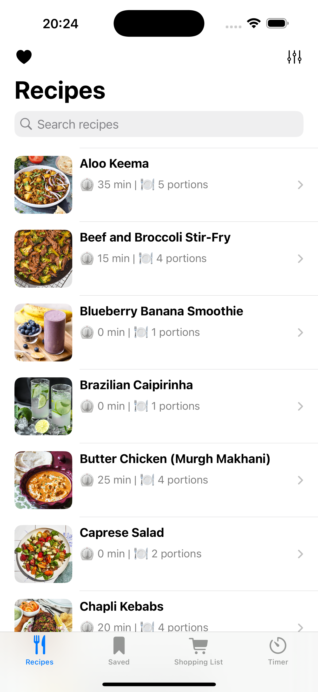
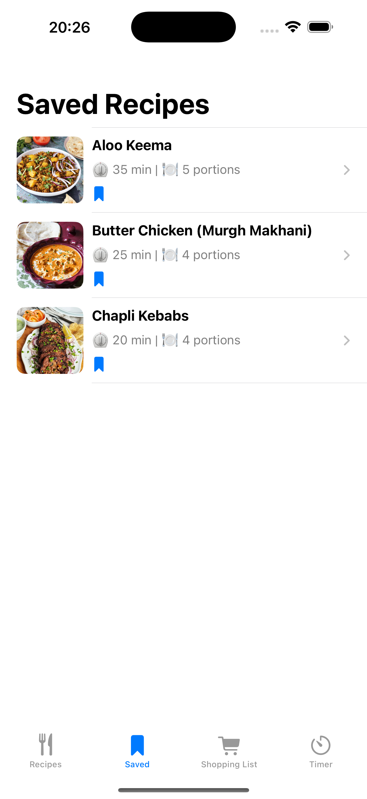
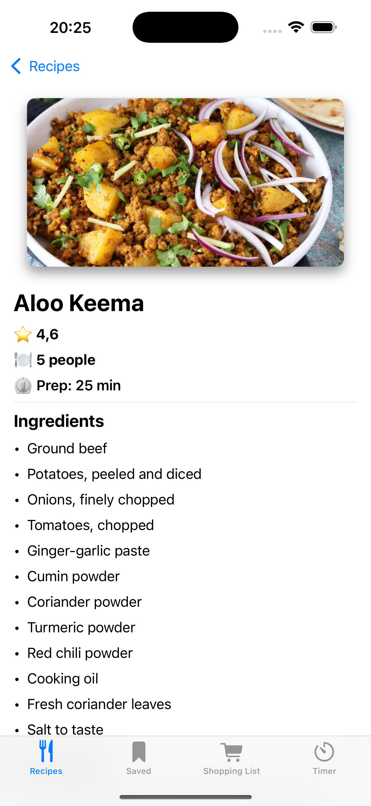
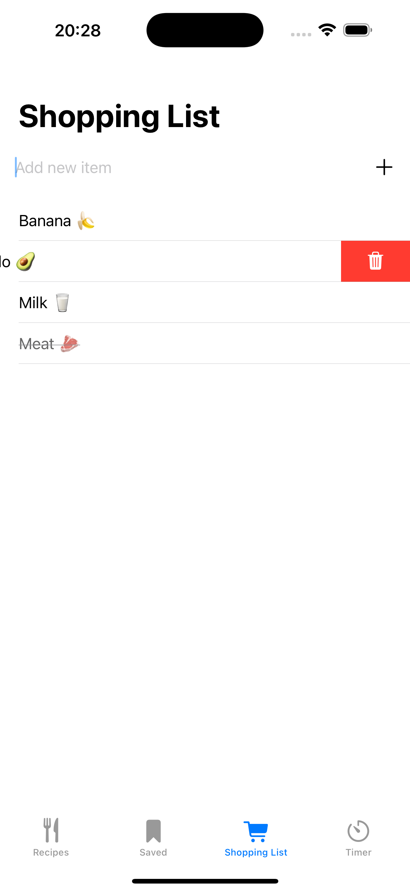
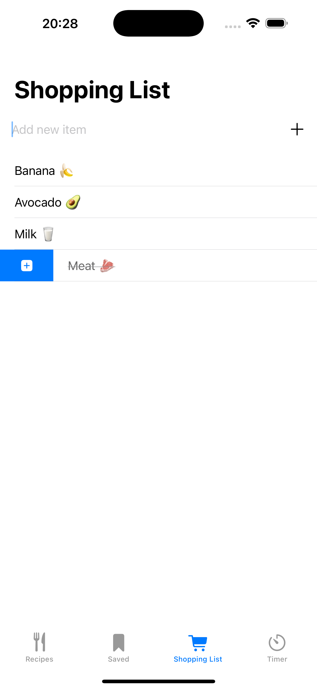
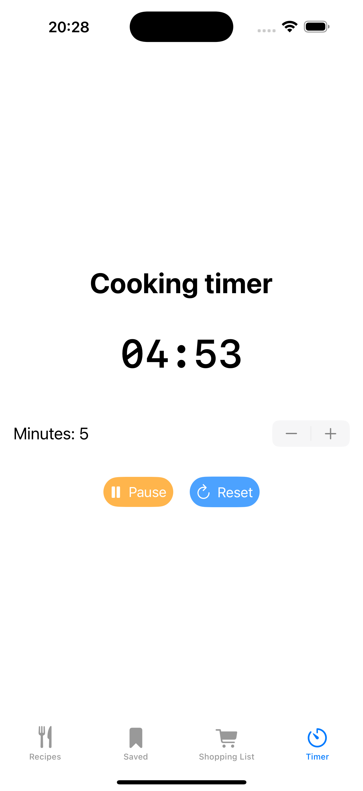

# RecipesApp


A SwiftUI application for practicing the `@Observable` pattern, data persistence with SwiftData, and unit testing with SwiftTesting.

## Features

* **Load Recipes from JSON**: Import recipe data from a local `recipes_formatted.json` file.
* **Data Persistence with SwiftData**: Persist recipes, favorites, saved items, and shopping list to disk.
* **Favorites & Saved Lists**: Quickly access recipes you’ve marked as favorite or saved.
* **Shopping List**: Add and remove shopping items with a modern SwiftUI interface, backed by SwiftData.
* **Cooking Timer**: Set a countdown timer to notify you when cooking time is up.
* **Tabbed Interface**: Navigate between Home, Favorites, Saved, Shopping List, and Timer tabs in a clean TabView.

## Architecture & Patterns

* **Observable Models**: All data models conform to the `@Observable` pattern for reactive UI updates.
* **MVVM Structure**:

  * **Models**: Recipe, ShoppingItem, TimerModel
  * **ViewModels**: RecipeListViewModel, RecipeDetailViewModel, ShoppingListViewModel, TimerViewModel
  * **Views**: SwiftUI views for list, detail, shopping list, and timer screens.
* **SwiftData**: Core persistence layer handling CRUD operations for all entities.
* **Unit Testing**: Comprehensive test suite using SwiftTesting to cover models, view models, and persistence logic.

## Getting Started

### Prerequisites

* Xcode 17 or later
* iOS 17 or later
* Swift 5.9

### Installation

1. **Clone the repository**:

   ```bash
   git clone https://github.com/aitorballes/RecipeApp.git
   cd RecipeApp
   ```
2. **Open in Xcode**:

   ```bash
   open RecipeApp.xcodeproj
   ```
3. **Run** on Simulator or Device (⌘R).

## Project Structure

```
RecipeApp/
├── Resources              # App assets and icons, sounds and jsons
├── Models/                # @Model data models with SwiftData
├── ViewModels/            # @Observable view models
├── Views/                 # SwiftUI views
├── Repositories/          # SwiftData CRUD & JSON loader
└── Tests/                 # SwiftTesting unit tests
```

## Screenshots

<p align="center">        </p>


## Testing

Run the unit tests in Xcode (⌘U) to verify data models, persistence logic, and view models are working as expected.

📌 **Author:** Aitor Ballesteros
📧 **Contact:** aitorballesteros@gmail.com
